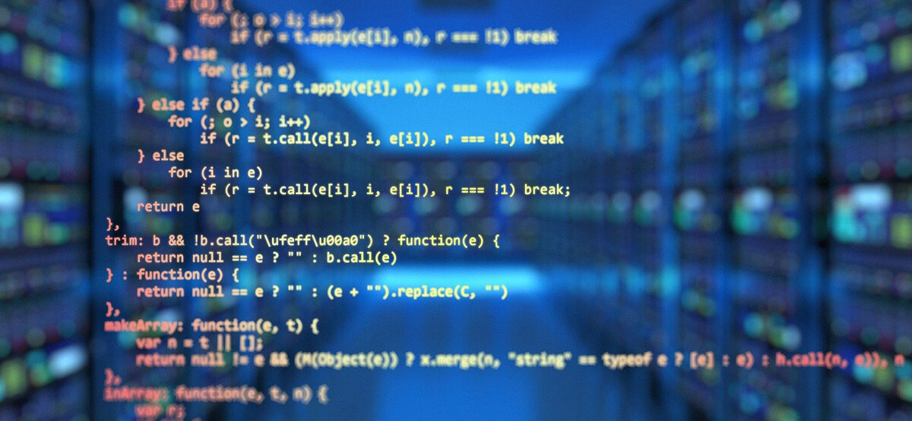

# Presentación

   Me llamo Aurelio Gareca, vivo en Hurlingham y estoy cursando el segundo año de la carrera Tecnicatura Universitaria en Programación, aunque tengo pensado continuar con la Licenciatura. Me empecé a interesar en la programación hace dos años y antes de anotarme a la carrera ya venía haciendo cursos y estudiando de forma autodidacta.
   Tengo dos mascotas, un perro y un gato, y en mi tiempo libre me gusta escuchar música, tocar piano o practicar francés. La última película que ví y me gustó mucho fue The Whale.

```
object programacionConObjetos { 
    method saludar() { 
        return  "Bienvenidxs!" 
    }
}
```

## Materias que ya aprobé:
* Introducción a lógica y problemas computacionales
* Matemática para informática I
* Organización de computadoras I
* Programación estructurada
* Matemática para informática II
* Taller de lenguajes de marcado y tecnologías web
* Nuevos entornos y lenguajes
* Bases de datos

## Materias que estoy cursando este 1er cuatrimestre 2023:
- Programación de Objetos I
- Estructuras de datos
- Inglés I

### Referencias Markdown 
* [Wikipedia](https://es.wikipedia.org/wiki/Markdown)

* [Guía Ràpida](https://greg.schueler.us/doc/markdown.txt) de la sintaxis _(en inglés)_

* [Emojis!](https://github.com/ikatyang/emoji-cheat-sheet/blob/master/README.md) :sunglasses:
